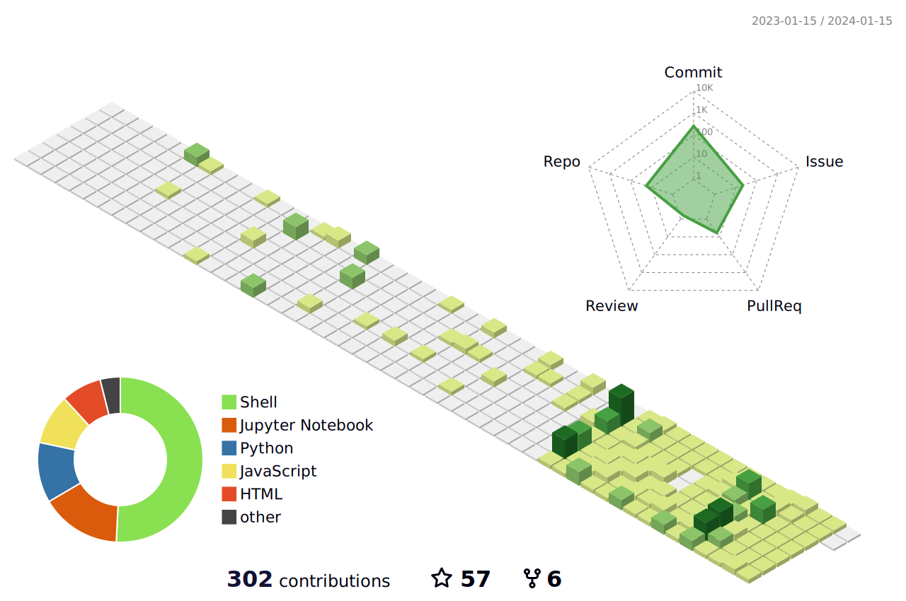

<!--   my-icons -->

    
    
    
    
       

<!--   my-header-img -->

  

<!--   my-ticker -->    

   <!-- my-kaggle      -->
<!-- ### My achievements on [kaggle](https://www.kaggle.com/andrej0marinchenko):

 -->

<!--   my-skils -->

| Property                                        | Data                                                                                                                                                                                                                                                                                                                                                                                                                                                                                                                                                                                                                                                                                                                                                                                                                                                                                                                                                                                                                                                                                                                                                                                                                                                                                                                                                                                                                                                                                                                                                                                                                                                                                                                                                                                                            |
|-------------------------------------------------|-----------------------------------------------------------------------------------------------------------------------------------------------------------------------------------------------------------------------------------------------------------------------------------------------------------------------------------------------------------------------------------------------------------------------------------------------------------------------------------------------------------------------------------------------------------------------------------------------------------------------------------------------------------------------------------------------------------------------------------------------------------------------------------------------------------------------------------------------------------------------------------------------------------------------------------------------------------------------------------------------------------------------------------------------------------------------------------------------------------------------------------------------------------------------------------------------------------------------------------------------------------------------------------------------------------------------------------------------------------------------------------------------------------------------------------------------------------------------------------------------------------------------------------------------------------------------------------------------------------------------------------------------------------------------------------------------------------------------------------------------------------------------------------------------------------------|
| **Language**                              |                                                                                                                                                                                                                                                                                                                                                                                                                                                                                                                                                                                                                                                                                                                                                                                                                                                                                                                                                                                                                                                                                                                                                                                                                                                                                                                                                                                                                                                                                                           |
| **Domain Knownledge**                           |                                                                                                                                                                                                                                                                                                                                                                                                                                                                                                                                                                                                                                                                                                                                                                                                                                                                                                                                                                                                                                                                                                               |
| **CI / CD**                                     |                                                                                                                                                                                                                                                                                                                                                                                                                                                                                                                                                                                                                                                                                                                                                                                                                                                                                                                                                                                                                                                                                                                                                                                                                                                                                                                                                                                     |
| **Databases**                                   |                                                                                                                                                                                                                                                                                                                                                                                                                                                                                                                                                                                                                                                                                                                                                                                                                                                                                                                                                |
| **OS**                                          |                                                                                                                                                                                                                                                                                  |
| **Tools & Platform**                            |            | 
| **Machine Learning / Deep Learning frameworks**                            |         | 
---

<!--   GitHub stats graph -->
### 📈 GitHub Activity Graph:

| .                                                                                                                                       | .                                                                                                                         |
|-----------------------------------------------------------------------------------------------------------------------------------------|---------------------------------------------------------------------------------------------------------------------------|
|  |  |

</img>

 <b>Note:</b> Top languages is only a metric of the languages my public code consists of and doesn't reflect experience or skill level.

<!--   profile-green-animate -->

  
  <!-- https://github.com/ashutosh00710/github-readme-activity-graph -->

  

**📫 How to Reach me:**

 

    
<!--   -->

<!--  -->

---

Trophy: Github Profile Trophy

 

 

 

Trophy: Hackerrank Profile Trophy

<!-- Belarus - My Home-->
  

#### Thanks for visiting :heart:

 
  

counting of visitors to this page in this section started from May 8, 2022

### Profile Views
counting of visitors to this page in this section started from August 17, 2023

  

 

Would you ike to meet me?

If you want to contribute to any of my repositories, feel free to submit PRs, issues and email me. Pick a slot if you'd like to meet me and chat about proposals and ideas - but make sure to describe the agenda

